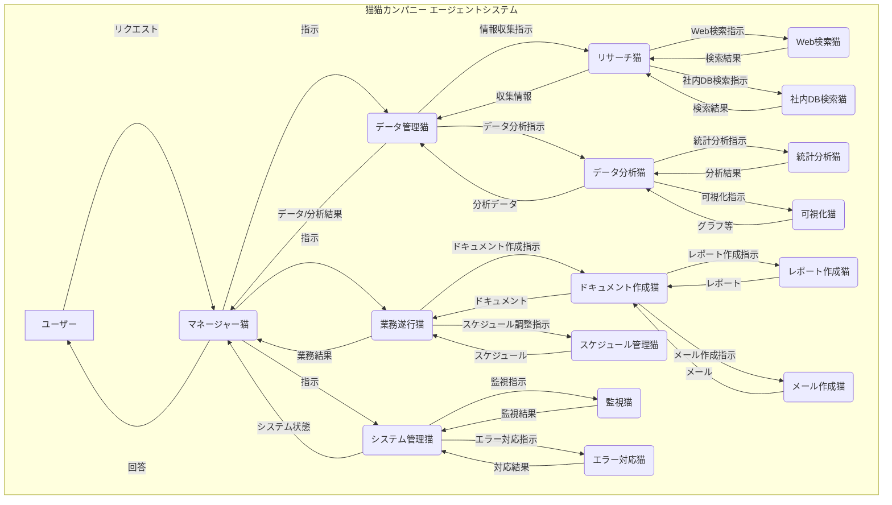

# 猫猫カンパニー NekoNexus

<div align="center">
  
</div>

## 📋 目次

- [🌟 システム概要](#-システム概要)
- [🧠 エージェント構成](#-エージェント構成)
- [🔄 データフロー](#-データフロー)
- [⚙️ 技術仕様](#-技術仕様)
- [🚀 セットアップと利用方法](#-セットアップと利用方法)
- [👥 開発チーム構成](#-開発チーム構成)
- [📊 今後の拡張](#-今後の拡張)

## 🌟 システム概要

**NekoNexus**は猫猫カンパニーの業務効率化、顧客満足度向上、社内コミュニケーション円滑化のためのAIエージェントによる自律的タスク処理システムです。

- **プロジェクト名:** agno-company-NekoNexus-sample
- **目的:** 業務効率化、顧客満足度向上、社内コミュニケーション円滑化
- **コンセプト:** 猫をモチーフにした親しみやすいインターフェースと、各エージェントに猫の特性を模した個性を持たせることで、社員が楽しみながら利用できるシステム
- **フレームワーク:** agno-origin
- **構成:** 6種類の主要エージェントと、その下にさらに専門化されたサブエージェントによる階層型構造

## 🧠 エージェント構成

NekoNexusは階層型のエージェント構成を採用しています。上位エージェントがタスクを分解・委譲し、下位エージェントが専門的な処理を実行します。



### エージェント一覧

- **U (User):** ユーザー（人間）
- **MN (Manager Cat):** マネージャー猫 (最上位エージェント)
- **DM (Data Manager Cat):** データ管理猫
- **RN (Research Cat):** リサーチ猫
- **WRN (Web Research Cat):** Web検索猫
- **IRN (Internal DB Research Cat):** 社内DB検索猫
- **DN (Data Analyst Cat):** データ分析猫
- **SAN (Statistical Analysis Cat):** 統計分析猫
- **VN (Visualization Cat):** 可視化猫
- **OM (Operation Manager Cat):** 業務遂行猫
- **DWN (Document Writer Cat):** ドキュメント作成猫
- **RWN (Report Writer Cat):** レポート作成猫
- **EWN (Email Writer Cat):** メール作成猫
- **SN (Scheduler Cat):** スケジュール管理猫
- **SMN (System Manager Cat):** システム管理猫
- **MON (Monitor Cat):** 監視猫
- **ERH (Error Handler Cat):** エラー対応猫

## 🔄 データフロー

1. **ユーザーリクエスト:** ユーザーがマネージャー猫に自然言語でリクエスト
2. **タスク分解:** マネージャー猫がリクエストを解析、データ管理猫または業務遂行猫へ指示
3. **タスク委譲:**
   - データ管理猫：リサーチ猫へ指示（Web検索猫、社内DB検索猫を統括）。データ分析猫へも指示（統計分析猫、可視化猫を統括）
   - 業務遂行猫：ドキュメント作成猫（レポート作成猫、メール作成猫を統括）、スケジュール管理猫へ指示
   - システム管理猫：監視猫とエラー対応猫へ指示
4. **タスク実行:** 各エージェント/サブエージェントが専門タスクを実行
5. **結果報告:** サブエージェント → 上位エージェント → マネージャー猫へ結果が集約
6. **回答生成:** マネージャー猫が収集された情報とタスク実行結果からユーザーへの回答を生成
7. **フィードバック:** ユーザーからのフィードバックを学習し、次回の応答精度を向上
8. **システム監視:** システム管理猫は常にシステムを監視し、必要に応じてマネージャー猫、または人間に報告

## 🐱 エージェント詳細

### 1. マネージャー猫 (Manager Cat)
最上位エージェントとして、ユーザーからのリクエストを理解し、適切な下位エージェントに指示を出します。各エージェントからの結果を統合し、最終的な回答を生成します。

### 2. データ管理猫 (Data Manager Cat)
情報収集と分析を担当する中間管理エージェントです。リサーチ猫とデータ分析猫を管理し、情報の流れを制御します。

#### 2.1 リサーチ猫 (Research Cat)
Web検索猫と社内DB検索猫を統括し、情報収集を行います。様々なソースから必要な情報を収集し、構造化します。

#### 2.2 データ分析猫 (Data Analyst Cat)
統計分析猫と可視化猫を統括し、収集されたデータの分析と可視化を行います。

### 3. 業務遂行猫 (Operation Cat)
業務タスクを担当する中間管理エージェントです。ドキュメント作成猫とスケジュール管理猫を管理します。

#### 3.1 ドキュメント作成猫 (Document Cat)
レポート作成猫とメール作成猫を統括し、各種文書の作成を行います。

#### 3.2 スケジュール管理猫 (Scheduler Cat)
会議やタスクのスケジュール調整、リマインダーの設定を行います。

### 4. システム管理猫 (System Cat)
システム全体の監視と問題対応を担当する中間管理エージェントです。システムの安定稼働を維持します。

#### 4.1 監視猫 (Monitor Cat)
システムの各種メトリクス（CPU、メモリ、ディスク、ネットワーク等）を常時監視し、異常を検知します。問題の予兆を早期に発見し、アラートを発生させます。

#### 4.2 エラー対応猫 (Error Handler Cat)
発生したエラーや問題を分析し、適切な対応策を提案・実行します。エラーパターンを学習し、同様の問題の再発防止に貢献します。

## ⚙️ 技術仕様

### 共通仕様

- **model**: `OpenAIChat(id="gpt-4o")` (基本。タスクにより`claude-3`など他モデルも検討)
- **markdown**: True
- **show_tool_calls**: True (開発中はTrue、本番運用ではFalseも検討)
- **add_history_to_messages**: True
- **memory**: 必要に応じて`AgentMemory`を設定
- **storage**: `SqliteAgentStorage` (SQLiteにセッション情報を保存)

### 主要エージェント詳細

#### マネージャー猫
- **description**: ユーザーインターフェース、タスク管理、エージェント間連携を行う最上位エージェント
- **instructions**: ユーザーリクエスト理解、タスク分解、下位エージェントへの指示、報告集約、最終回答生成、ユーザー対話、必要に応じて追加情報要求
- **expected_output**: ユーザーへの最終回答（テキスト、表、グラフなど）

#### データ管理猫
- **description**: リサーチ猫とデータ分析猫を統括し、情報収集と分析を管理
- **instructions**: リサーチ猫への指示（Web検索/社内DB検索の使い分け）、データ分析猫への指示（分析内容、可視化方法）、結果の統合

#### 業務遂行猫
- **description**: ドキュメント作成猫とスケジュール管理猫を統括
- **instructions**: ドキュメント作成猫への指示（内容、フォーマット）、スケジュール管理猫への指示（会議設定、タスク管理）、結果をマネージャー猫へ報告

#### システム管理猫
- **description**: システム監視、ログ収集、エラー対応
- **instructions**: リソース監視、エラーログ収集・分析、異常検知、マネージャー猫/システム管理者への通知、簡易メンテナンス
- **tools**: `shell_tools`

## 🚀 セットアップと利用方法

### 前提条件
- Python 3.9+
- pip
- agno-origin フレームワーク

### インストール手順

1. リポジトリのクローン
```bash
git clone https://github.com/Sunwood-ai-labs/agno-sample-company-NekoNexus.git
cd agno-sample-company-NekoNexus
```

2. 依存パッケージのインストール
```bash
pip install -r requirements.txt
```

3. 環境変数の設定
```bash
cp .env.example .env
# .envファイルを編集してAPIキーなどを設定
```

4. アプリケーションの起動
```bash
python src/main.py
```

### 使用方法

1. ブラウザで`http://localhost:8501`にアクセス
2. マネージャー猫に自然言語でリクエストを入力
3. 結果を確認・必要に応じて追加質問

## 👥 開発チーム構成

- **プロジェクトマネージャー (1名)**: プロジェクト進行管理、要件定義、エージェント間連携設計
- **AIエンジニア (2名)**: 各エージェントの設計、実装、テスト
- **バックエンドエンジニア (1名)**: データベース、API、システム全体のインフラ構築
- **フロントエンドエンジニア (1名)**: ユーザーインターフェース (Streamlitなど) 設計、実装
- **データサイエンティスト/アナリスト (1名)**: データ分析猫の機能強化、データ収集・分析基盤構築

## 📊 今後の拡張

- **マルチモーダル対応**: 画像、音声、動画
- **外部サービス連携**: Slack, Teams, Jira等
- **学習機能**: ユーザーフィードバック、利用状況から性能向上
- **セキュリティ強化**: 認証、認可、データ暗号化
- **ダッシュボード**: エージェント稼働状況、パフォーマンス可視化

---

© 2025 猫猫カンパニー All Rights Reserved.